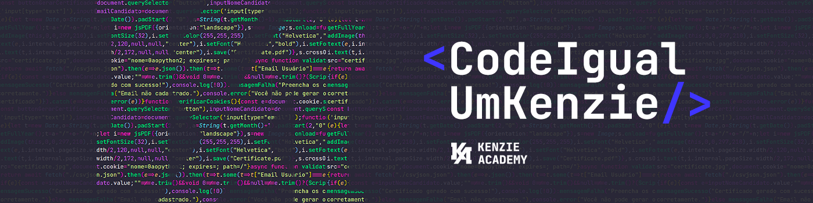

# Instruções

Essa atividade tem como objetivo **fixar mais os métodos de array que aprendemos até agora de uma forma mais simples**!

Todos os arquivos necessários para desenvolver as soluções esperadas estão nesse projeto, incluindo os testes, então **NÃO MOVA OS ARQUIVOS DE LOCAL PARA QUE TUDO FUNCIONE CORRETAMENTE**.

### 🧪 Testes

Os [testes](./scripts/test.js) foram feitos com `console.assert()`, ou seja, só mostrarão os resultados no console do navegador quando existir um erro, e se tudo estiver funcionando corretamente, nada será exibido.

Para fazer uso deles, basta **abrir esse projeto com o [Live Server](https://marketplace.visualstudio.com/items?itemName=ritwickdey.LiveServer) e visualizar tudo no console do seu navegador** (também é possível abrir o HTML com o navegador, mas não se esqueça de atualizar a página a cada modificação feita).

### 🚨 Atenção

É de extrema importância que você **desenvolva as atividades abaixo na ordem em que são apresentadas**!

# Atividades

## 1. [Map](./scripts/map.js)

Desenvolva ambas as atividades abaixo usando o método **[`map()`](https://developer.mozilla.org/pt-BR/docs/Web/JavaScript/Reference/Global_Objects/Array/map)**.

> As funções deverão retornar o conteúdo modificado, mas **sem alterar o array original**!

### Atividade 01

Adicione as letras `"ar"` ao fim de cada palavra dentro do `arrayMap1`.

Por exemplo, a palavra `consolid` deverá ficar `consolidar` após o método ser executado.

### Atividade 02

Adicione a chave `idade` para cada integrante do `arrayMap2`, tendo como valor o ano que o mesmo nasceu.

#### 💡 Dica

A idade de uma pessoa é calculada por meio da subtração do ano atual (2022) pelo ano de nascimento.

---

## 2. [Filter](./scripts/filter.js)

Desenvolva ambas as atividades abaixo usando o método **[`filter()`](https://developer.mozilla.org/pt-BR/docs/Web/JavaScript/Reference/Global_Objects/Array/filter)**.

> As funções deverão retornar o conteúdo modificado, mas **sem alterar o array original**!

### Atividade 01

Filtre os dados do `arrayFilter1`, retornando apenas os números que sejam ímpar e que estejam entre `70` e `300`.

#### 💡 Dica

Leia sobre [operadores lógicos](https://developer.mozilla.org/pt-BR/docs/Web/JavaScript/Guide/Expressions_and_Operators#operadores_l%C3%B3gicos) disponíveis no JavaScript.

### Atividade 02

Filtre os dados do `arrayFilter2`, retornando os programadores (objetos) que possuem o `nivel_profissional` passado por parâmetro.

_Observação: Nenhum dado terá acentuação e sempre começando com a primeira letra maiúscula, ex. `Junior` ou `Pleno`._

Por exemplo, caso seja passado `Senior`, o retorno deverá ser um array de programadores que tenham esse nível profissional.

---

## 3. [Find](./scripts/find.js)

Desenvolva ambas as atividades abaixo usando o método **[`find()`](https://developer.mozilla.org/pt-BR/docs/Web/JavaScript/Reference/Global_Objects/Array/find)**.

> As funções deverão retornar um elemento esperado, **sem alterar o array original**!

### Atividade 01

Encontre, no array `arrayFind1`, a primeira palavra que tenha a mesma quantidade de letras que foi passada por parâmetro.

### Atividade 02

Encontre, no array `arrayFind2`, o primeiro dev (objeto) que possuir o valor passado por parâmetro como uma das `entregas_concluidas`.

#### 💡 Dica

Você pode usar o método [`includes()`](https://developer.mozilla.org/pt-BR/docs/Web/JavaScript/Reference/Global_Objects/Array/includes) para fazer essa atividade.

---

## 4. [Reduce](./scripts/reduce.js)

Desenvolva ambas as atividades abaixo usando o método **[`reduce()`](https://developer.mozilla.org/pt-BR/docs/Web/JavaScript/Reference/Global_Objects/Array/reduce)**.

> As funções deverão retornar o valor esperado, **sem alterar o array original**!

### Atividade 01

Retorne a soma de todos os dados no `arrayReduce1`.

Use seus conhecimentos sobre todos os valores de entrada do `reduce` e inicie a soma com o valor passado pelo parâmetro da função.

### Atividade 02

Some a quantidade de livros lidos e subtraia do valor de livros não lidos por todas as pessoas (objetos) do `arrayReduce2`.

#### 💡 Dica

Tente usar dois `reduce`s para fazer essa atividade.
